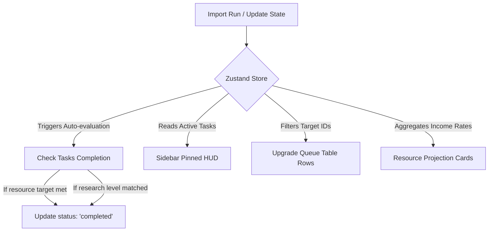

# Design Proposal: Tasks & Highlights System for Tower Planner

This document proposes a comprehensive design for tracking user goals, active labs, and experiments (referred to as **Tasks**) and displaying them using high-visibility UI styling (**Highlights**) across the Tower Planner application.

---

## 1. Core Philosophy: Planning vs. Tracking

As outlined in the specifications, Tower Planner is a **forward-looking decision tool**, not a passive statistics archive. 

A **Tasks & Highlights** system shifts the app from showing lists of data to guiding active player gameplay:
* **Passive View**: "Here is a sorted table of 20 upgrades based on impact."
* **Active View (Tasks)**: "You are currently tracking **Garlic Thorns Lv.13** and **6th UW (Stones)**. Here is your progress, how many runs you need, and a highlighted suggestion on which lab slot to slot them into."

---

## 2. Technical Architecture & Data Model

We will store tasks in our Zustand store (`src/domain/store.ts`) so they are automatically persisted to `localStorage`.

### 2.1 Schema Definition
We define a unified `PlannerTask` structure that can accommodate different targets (Research, Resources, or Experiments).

```typescript
export type TaskType = 'research' | 'resource' | 'experiment';
export type TaskStatus = 'active' | 'completed' | 'paused';

export interface PlannerTask {
  id: string;
  type: TaskType;
  name: string;
  status: TaskStatus;
  createdAt: string; // ISO String
  
  // Specific payload based on type
  targetResearchId?: string; // Links to researchCatalog ID
  targetLevel?: number;
  
  targetResource?: 'coins' | 'cells' | 'gems' | 'stones' | 'shards';
  targetAmount?: number;
  
  experimentTier?: number;
  experimentRequiredRuns?: number;
  experimentCompletedRunIds?: string[];

  // User notes
  notes?: string;
}
```

### 2.2 Zustand Store Actions
To manage these tasks dynamically, we add the following actions to the store:
```typescript
interface StoreState {
  // Existing state...
  tasks: PlannerTask[];
  
  addTask: (task: Omit<PlannerTask, 'id' | 'createdAt' | 'status'>) => void;
  updateTask: (id: string, updates: Partial<PlannerTask>) => void;
  deleteTask: (id: string) => void;
  
  // Automated updates triggered during new run imports or build modifications
  checkTaskCompletions: () => void;
}
```

---

## 3. UI/UX Design & Highlighting Strategies

To make tasks feel central to the app, we implement three levels of highlighting:

### 3.1 Pinned HUD (Heads-Up Display)
* **Where**: A sticky sidebar widget or a horizontal bar below the header, persistent across all pages.
* **What**: Shows the 2-3 most critical tasks (e.g. active lab timers and next big coin/stone target).
* **Aesthetics**: Glassmorphic dark card, subtle border glow, and a micro-animated circular progress indicator.

### 3.2 Contextual Table Highlighting
* **Where**: Inside tables like the **Upgrade Queue**.
* **What**: When a research is marked as a target task, its row in the queue highlights to distinguish it from standard recommendations.
* **Aesthetics**:
  * Left-border colored highlight (Indigo/Gold).
  * A pulsating dot indicator next to the title.
  * A custom "Target Task" badge.

### 3.3 Resource Projection Cards (With Run Estimation)
* **Where**: Build State / Dashboard.
* **What**: Translates resource gaps into concrete milestones based on the user's realized income.
* **Aesthetics**:
  * Progress bar indicating percentage filled.
  * Helper tooltip: *"At your current T9 average rate, you need **3.2 more runs** (approx. 15 hours of play) to afford this upgrade."*

---

## 4. Visual Mockup & Flow Diagrams

Here is how the contextual highlight coordinates with other views:



### Contextual Row Highlight Mockup (Tailwind CSS v4)
When rendering the Upgrade Queue table, we apply a dynamic check:

```tsx
const isTask = activeTasks.some(t => t.targetResearchId === item.id);

return (
  <tr 
    key={item.id} 
    className={`transition-all duration-200 ${
      isTask 
        ? 'bg-indigo-500/10 border-l-4 border-indigo-500 hover:bg-indigo-500/15' 
        : 'hover:bg-zinc-900/20'
    }`}
  >
    <td className="p-3 font-semibold text-white">
      <div className="flex items-center space-x-2">
        {isTask && <span className="w-2 h-2 rounded-full bg-indigo-400 animate-pulse" />}
        <span>{item.name}</span>
        {isTask && (
          <span className="px-1.5 py-0.5 rounded bg-indigo-500/20 text-[9px] text-indigo-300 font-mono uppercase font-bold tracking-wider">
            Active Goal
          </span>
        )}
      </div>
    </td>
    {/* ... remaining columns ... */}
  </tr>
);
```

---

## 5. Next Steps

If we proceed with this design, the implementation plan will involve:
1. **Model & State Setup**: Updating `src/domain/store.ts` to include the `tasks` slice and actions.
2. **Global HUD Component**: Creating `src/components/TaskHUD.tsx` and adding it to the persistent frame layout (`src/components/Layout.tsx`).
3. **Upgrade Queue Integration**: Adding the check and highlighting styling to `src/components/UpgradeQueue.tsx`.
4. **Goal Creator UI**: Adding a goal planner panel in `src/components/BuildState.tsx` to let users easily check/uncheck active research goals, target stone counts, etc.
