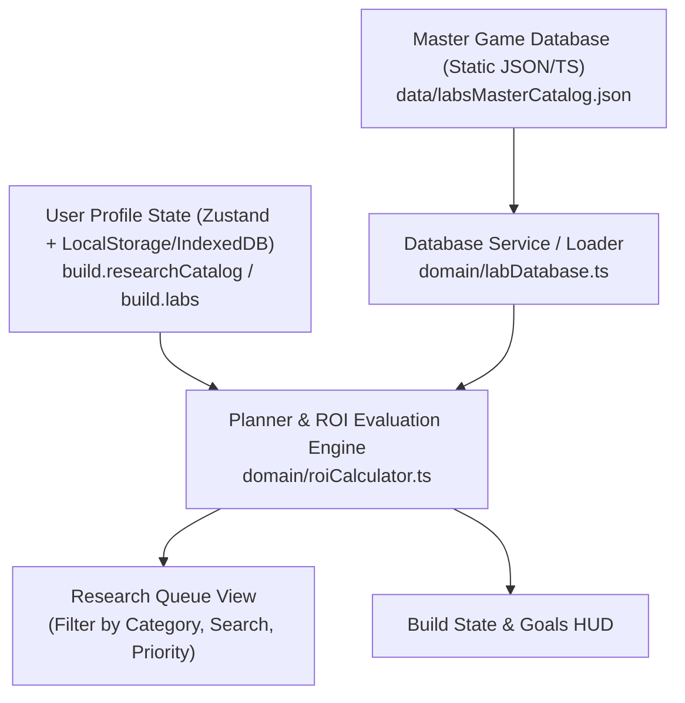

# Plan: Rename to "Research Queue", Lab Catalog Audit & Database Strategy

This plan addresses:
1. Renaming **"Upgrade Queue"** to **"Research Queue"** across navigation, components, headers, and routes.
2. Auditing all in-game labs against the wiki (comparing our current 14-item seed catalog against the full 100+ game lab catalog).
3. Designing a robust, scalable architecture to manage the full database of labs, user progression, and future extensibility.

---

## 1. UI Rename: "Upgrade Queue" → "Research Queue"

### Proposed Changes

#### Navigation & Components
- **[Layout.tsx](file:///Users/mbp-m1-pro/Developer/projects/tower-planner/src/components/Layout.tsx)**:
  - Change navigation tab label from `"Upgrade Queue"` to `"Research Queue"`.
  - Update tab identifier to `'research-queue'` (or keep internal key with display name update).
- **[UpgradeQueue.tsx](file:///Users/mbp-m1-pro/Developer/projects/tower-planner/src/components/UpgradeQueue.tsx)** → **`ResearchQueue.tsx`**:
  - Rename component and file to [ResearchQueue.tsx](file:///Users/mbp-m1-pro/Developer/projects/tower-planner/src/components/ResearchQueue.tsx).
  - Update page title from `"Upgrade Queue"` to `"Research Queue"`.
  - Update table headers and references.
- **[App.tsx](file:///Users/mbp-m1-pro/Developer/projects/tower-planner/src/App.tsx)** & **[TaskHUD.tsx](file:///Users/mbp-m1-pro/Developer/projects/tower-planner/src/components/TaskHUD.tsx)**:
  - Update component imports and tab routing to reflect `ResearchQueue`.

---

## 2. Lab Catalog Audit: Current App vs. Full Wiki Encyclopedia

### Current App State
Our initial seed catalog (`INITIAL_RESEARCH_CATALOG` in [store.ts](file:///Users/mbp-m1-pro/Developer/projects/tower-planner/src/domain/store.ts)) contains **14 high-impact candidate labs** seeded from `DOMAIN.md §5` for immediate ROI decision modeling:
- *Garlic Thorns*, *Reroll Shards*, *Spotlight Coin Bonus*, *Death Wave Health*, *Improve Trade-off Perks*, *Death Wave Coin Bonus*, *Golden Tower Duration*, *Waves Required*, *Golden Tower Bonus*, *Standard Perks Bonus*, *Black Hole Coin Bonus*, *Ban Perks*, *Rare Drop Chance*, *BH disable Ranged Enemies*.

### Full Game Lab Encyclopedia (Wiki Comparison)
The actual game (*The Tower*) contains **100+ lab researches** divided across 6 core categories:

| Category | Wiki Lab Count | Key Researches in Game | Status in Current App |
| :--- | :--- | :--- | :--- |
| **Main / Labs** | ~8 | Game Speed, Lab Speed, Lab Coin Discount, Lab Speed Boost, More Round Stats, Target Priority | ⚠️ Partially tracked via multiplier |
| **Attack** | ~12 | Damage, Attack Speed, Crit Factor, Range, Dmg/Meter, Super Crit, Rend Armor | ⏳ Missing full level curves |
| **Defense** | ~22 | Health, Health Regen, Def %, Wall Health/Rebuild/Regen/Thorns/Fort, Garlic Thorns, Orb Speed, Extra Orbs, Land Mines | ✅ Garlic Thorns present; others need catalog entries |
| **Utility** | ~18 | Coins/Kill, Cash Bonus, Free Upgrades, Interest, Package Chance/Max, Enemy Level Skips | ⏳ Missing standard utility labs |
| **Perks & Cards** | ~12 | First Perk Choice, Auto Pick, Ban Perks, Standard Perks, Trade-off Perks, Waves Required, Card Presets | ✅ Ban Perks, Standard Perks, Trade-off Perks present |
| **Ultimate Weapons** | ~25 | GT Bonus/Duration, BH Coin/Damage/Disable Ranged/2nd BH, DW Health/Coin/Cell, SL Coin/Missiles, CF Duration/Reduction, CL Shock, PS Stun, SM Amp, ILM Stun | ✅ Key economy UW labs present |
| **Modules & Shards** | ~6 | Reroll Shards, Rare Drop Chance, Daily Mission Shards, Module Shard Cost | ✅ Reroll Shards, Rare Drop present |

---

## 3. Database Management Architecture Plan

To scale the app from the current 14 seed items to the complete 100+ lab database without bloating bundle size or causing data migrations issues, we propose a **tiered local database architecture**:

### Architecture Design

### Key Components

1. **Static Master Catalog (`src/data/labCatalog.json` or `src/domain/labCatalog.ts`)**:
   - Master data file containing all 100+ labs with metadata:
     - `id`, `name`, `category` (`main` | `attack` | `defense` | `utility` | `perks` | `ultimate_weapons` | `modules`), `maxLevel`, `wikiUrl`, `effectDescription`, `channelKey`.
     - Standard cost & time formula / tier brackets.
2. **User Research State Layer (`store.ts`)**:
   - Stores only user-specific delta: `{ id, currentLevel, targetLevel, customPriority, pinned }`.
   - Merges with Master Catalog at runtime to compute dynamic costs, ROI, and timings.
3. **Database Migration & Versioning Handler**:
   - Zustand `version: 2` migration function that seamlessly merges new master labs into existing saved user states without wiping progress.
4. **Data Management Tools (Settings / Import / Export)**:
   - **Export Full State**: Export all runs, build state, and lab settings as a portable `.json` backup.
   - **Import / Reset**: Import backup or reset to default seeds.
   - **Custom Lab Editor**: Allow users to tweak lab costs/times if game patches change values before wiki updates.

---

## Verification Plan

### Automated Tests
- Build & Lint checks (`npm run build && npm run lint`).
- Component tests verifying tab switching and task pinning.

### Manual Verification
- Navigate to http://localhost:5173/ and verify sidebar shows **Research Queue**.
- Confirm research rankings, pinning, filtering, and goal management work seamlessly.
