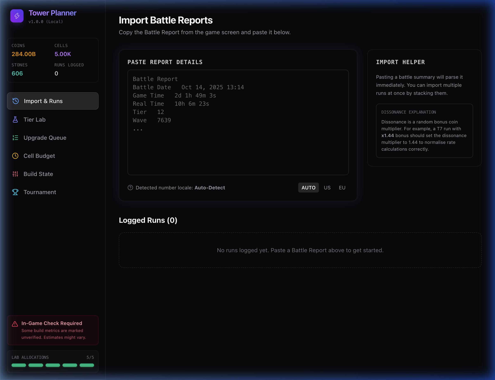
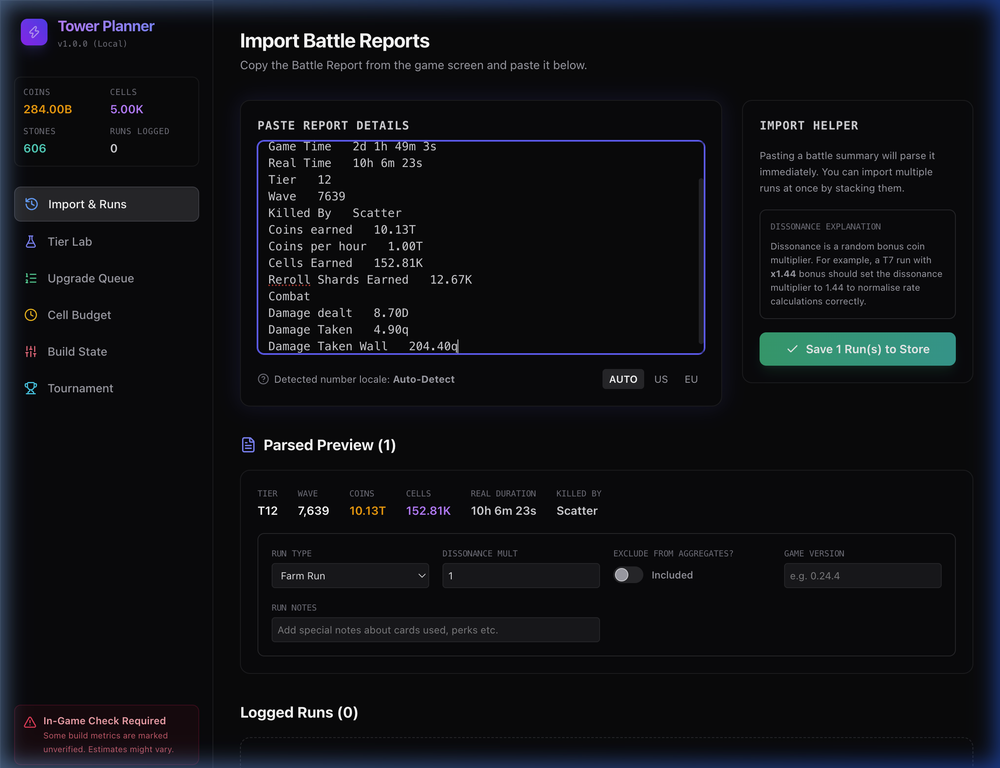
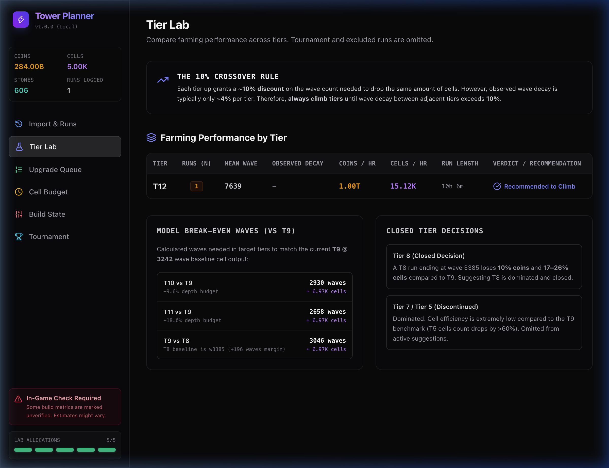
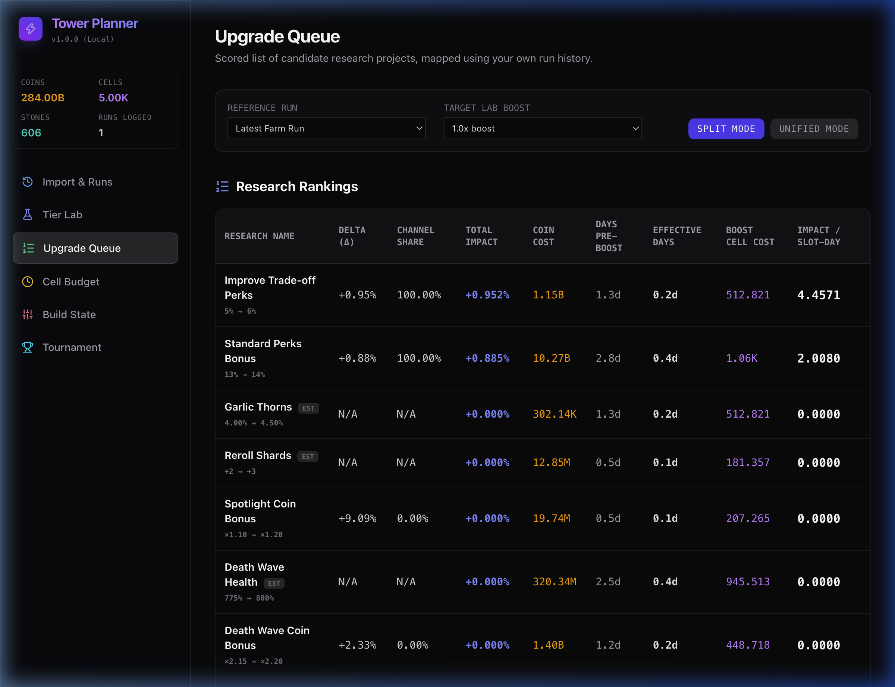

# Walkthrough - Tower Planner Core Release

We have successfully developed the core components and mathematical engines for **Tower Planner** based on the approved implementation plan. All features build cleanly, pass unit tests, and have been verified in the browser.

## Changes Made

### 1. Mathematical Logic and Data Parsing (`src/domain/`)
- [parser.ts](file:///Users/mbp-m1-pro/Developer/projects/tower-planner/src/domain/parser.ts): Developed a multi-locale separator detector, duration parser, suffix multiplier converter, and key normalizer.
- [cellModel.ts](file:///Users/mbp-m1-pro/Developer/projects/tower-planner/src/domain/cellModel.ts): Implemented the cumulative cell drop curve equations (`cum1`), wave-axis compression scaling, and target tier break-even solvers.
- [parser.test.ts](file:///Users/mbp-m1-pro/Developer/projects/tower-planner/src/domain/parser.test.ts): Added 6 Vitest test suites verifying parser locale handling, scale multipliers, and mathematical cell drop calculations (accuracy margins checked within 1%).

### 2. State Management & Storage (`src/domain/store.ts`)
- Configured a Zustand store slice featuring `persist` middleware to automatically synchronize the player's run logs and manual upgrade configurations to `localStorage`.

### 3. Cyberpunk UI Design System (`src/index.css`)
- Initialized core layers for Tailwind v4, custom smooth scrollbars, purple/indigo dark glassmorphism gradients, and cyberpunk neon glowing borders.

### 4. Interactive Pages & Sidebar Navigation (`src/components/`)
- [Layout.tsx](file:///Users/mbp-m1-pro/Developer/projects/tower-planner/src/components/Layout.tsx): Layout frame housing active resource tracking, occupied lab lane indicators, and verification checklist warnings.
- [ImportRuns.tsx](file:///Users/mbp-m1-pro/Developer/projects/tower-planner/src/components/ImportRuns.tsx): Paste box wizard that performs real-time parsing, crash run exclusions, auto-classifications, and unmatched keys reporting.
- [TierLab.tsx](file:///Users/mbp-m1-pro/Developer/projects/tower-planner/src/components/TierLab.tsx): Decides when to climb using the 10% crossover decay calculation against target tiers.
- [UpgradeQueue.tsx](file:///Users/mbp-m1-pro/Developer/projects/tower-planner/src/components/UpgradeQueue.tsx): Ranks candidate research, supports split and unified coin/cell equivalency tables, and triggers dead-levers warnings.
- [CellBudget.tsx](file:///Users/mbp-m1-pro/Developer/projects/tower-planner/src/components/CellBudget.tsx): Evaluates daily cells income against lab boost burns, featuring a cell calculator projector.
- [BuildState.tsx](file:///Users/mbp-m1-pro/Developer/projects/tower-planner/src/components/BuildState.tsx): Form managers for manual variables (currences, cards, UW levels) and verification checklists.
- [TournamentHistory.tsx](file:///Users/mbp-m1-pro/Developer/projects/tower-planner/src/components/TournamentHistory.tsx): Plottable tournament metrics mapping wave progression over brackets.

---

## Verification & Screenshots

### Automated Testing
Ran `npx vitest run` with all unit tests passing successfully:
```bash
 RUN  v4.1.11 /Users/mbp-m1-pro/Developer/projects/tower-planner

 ✓ src/domain/parser.test.ts (6 tests) 4ms

 Test Files  1 passed (1)
      Tests  6 passed (6)
   Duration  155ms
```

---

## Visual Walkthrough

### 1. Interactive Flow Recording
Below is the web recording demonstrating the full dashboard workflow, from pasting a raw Battle Report to saving it, viewing the Tier Lab, and analyzing research rankings.


---

### 2. UI Captures Carousel

````carousel

<!-- slide -->

<!-- slide -->

<!-- slide -->

````
