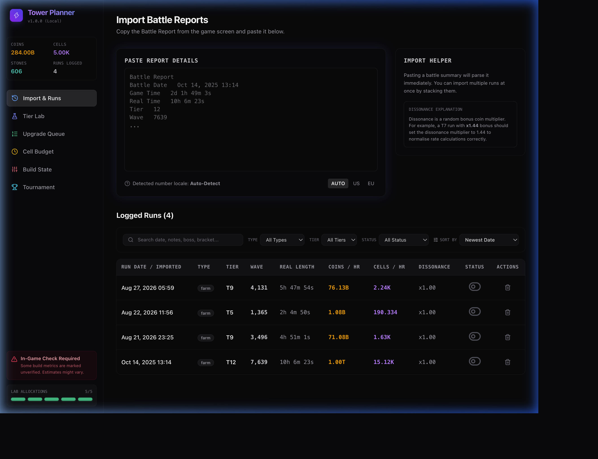
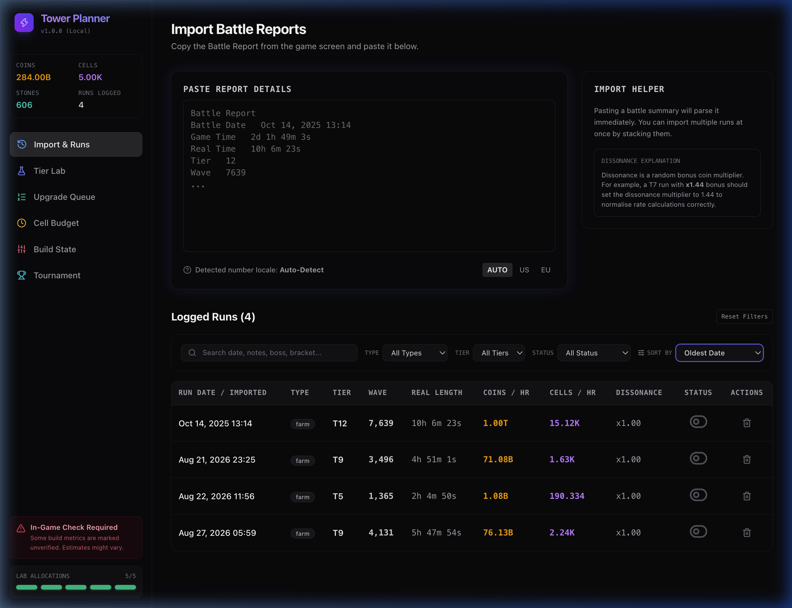
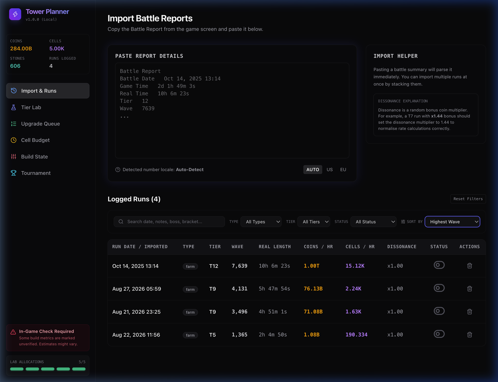
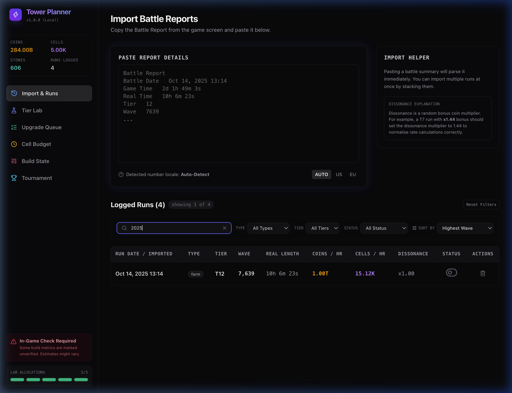
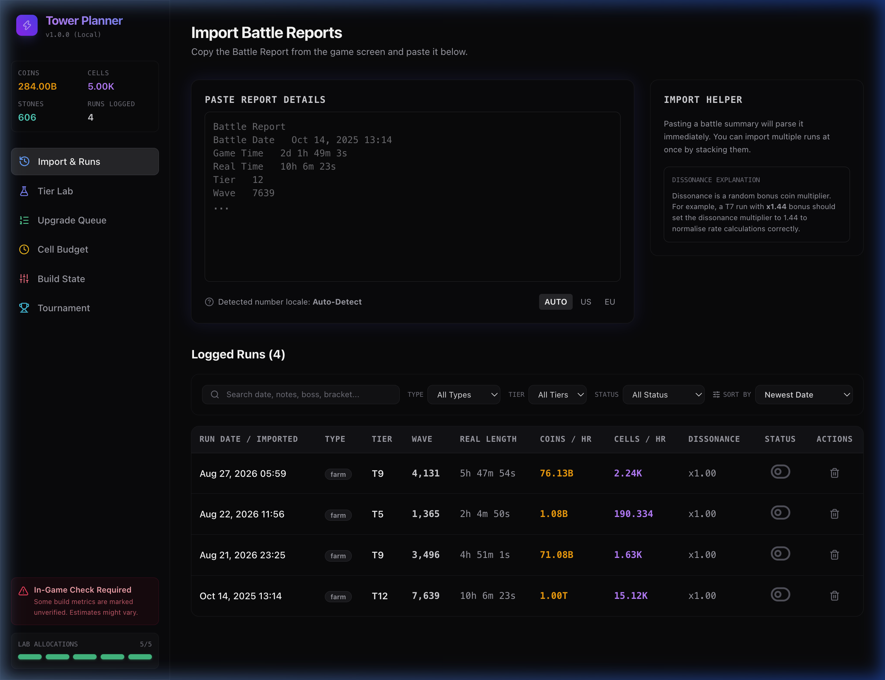
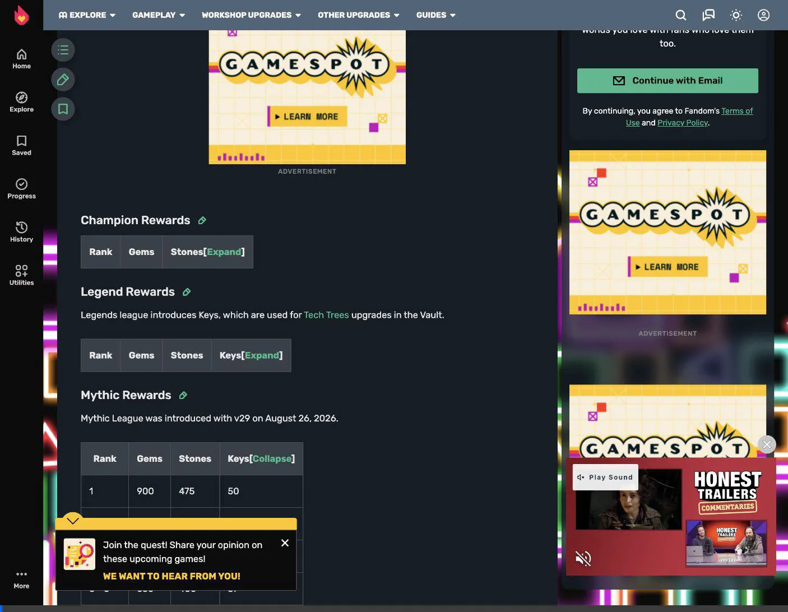

# Walkthrough: Sorting and Filtering Logged Runs

We added comprehensive sorting and filtering capabilities to the Logged Runs table list on the main import tab, and set the default sort order to **Newest Date**. We also resolved strict TypeScript compiler errors related to unused variables and tournament rank parameters.

## Changes Made

### 1. Import Runs Component ([`ImportRuns.tsx`](file:///Users/mbp-m1-pro/Developer/projects/tower-planner/src/components/ImportRuns.tsx))
- **Filters State**: Added state variables for `searchQuery`, `filterType`, `filterTier`, `filterStatus`, and `sortBy`.
- **Dynamic Tier Discovery**: Automatically derived the unique tiers currently present in the logged runs to populate the Tier dropdown dynamically.
- **Filtering Logic**: Implemented unified filtering of runs by:
  - Text search (matching dates, notes, bracket names, and boss types/killedBy).
  - Run Type (Farm, Tournament, Milestone).
  - Tier (e.g. T12, T12+, etc.).
  - Excluded/Active Status.
- **Sorting Logic**: Implemented sorting options:
  - **Newest Date** (Default)
  - **Oldest Date**
  - **Highest Wave**
  - **Highest Coins / Hour** (calculating hourly rate from run parameters)
  - **Highest Cells / Hour** (calculating hourly rate from run parameters)
- **UI Adjustments**: Added a responsive, modern control bar with clean dropdowns, a search input with a clear ('x') button, a count helper showing visible runs versus total runs, and a "Reset Filters" action.

### 2. Tournament History Component ([`TournamentHistory.tsx`](file:///Users/mbp-m1-pro/Developer/projects/tower-planner/src/components/TournamentHistory.tsx))
- Fixed two strict TypeScript compiler errors where `run.tournament?.rank` (of type `number | null | undefined`) was being passed directly to a function parameter expecting `number | null`. We resolved this by passing `run.tournament?.rank ?? null`.

---

## Visual Verification

We verified the UI and functionality using the browser subagent. Below are the key screenshots and video recording of the working filters and sorting.

### Screenshots

````carousel

<!-- slide -->

<!-- slide -->

<!-- slide -->

<!-- slide -->

````

### Screen Recording

You can watch the filter and sort interactions in action:

