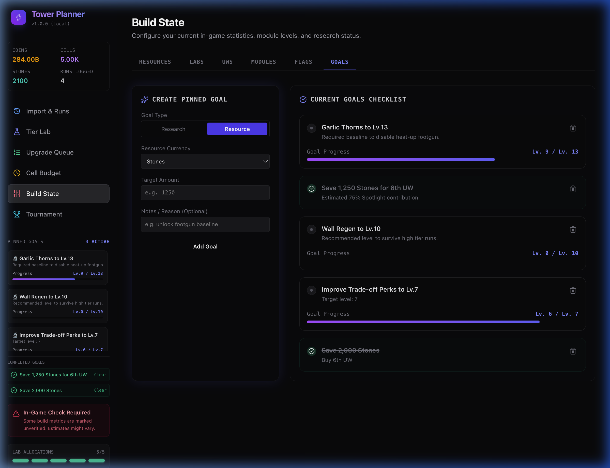
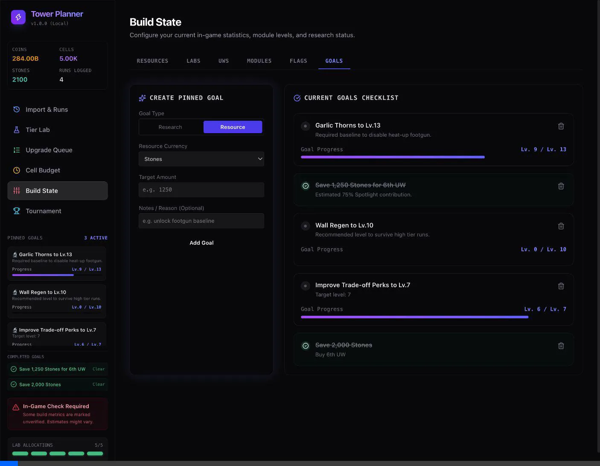

# Walkthrough: Tasks & Goals Tracking and Highlights

We have successfully implemented the **Tasks & Goals Tracking and Highlights** system. Here is a summary of the accomplishments, testing procedures, and visual evidence.

---

## 💻 Code Changes

### 1. Unified State Store
* **File modified**: [store.ts](file:///Users/mbp-m1-pro/Developer/projects/tower-planner/src/domain/store.ts)
* **What was done**:
  * Added the `PlannerTask` data types.
  * Added initial pre-seeded goals: Garlic Thorns target level 13, Stones target 1,250, and Wall Regen target level 10.
  * Added store actions: `addTask`, `updateTask`, `deleteTask`, and `checkTaskCompletions`.
  * Connected completion checks to resource and research catalog level updates.

### 2. Sidebar Heads-Up Display (HUD)
* **File created**: [TaskHUD.tsx](file:///Users/mbp-m1-pro/Developer/projects/tower-planner/src/components/TaskHUD.tsx)
* **File modified**: [Layout.tsx](file:///Users/mbp-m1-pro/Developer/projects/tower-planner/src/components/Layout.tsx)
* **What was done**:
  * Integrated the new `TaskHUD` component directly in the sidebar, displaying active task progress bars and list of completed goals.

### 3. Contextual Highlights & Pinning
* **File modified**: [UpgradeQueue.tsx](file:///Users/mbp-m1-pro/Developer/projects/tower-planner/src/components/UpgradeQueue.tsx)
* **What was done**:
  * Highlighted active goals with indigo border indicators and custom `Goal` badges.
  * Integrated a fast-pin toggle (Pin/Unpin icon) on each row.

### 4. Interactive Goals Manager
* **File modified**: [BuildState.tsx](file:///Users/mbp-m1-pro/Developer/projects/tower-planner/src/components/BuildState.tsx)
* **What was done**:
  * Added a dedicated **Goals sub-tab** to create custom Resource and Research targets and view active/completed checklist cards.

---

## 🧪 Testing and Verification

### Automated Tests
* Verified that type checking passes cleanly: `npx tsc --noEmit` exited with code 0.
* Verified that parser and model tests pass successfully: `npx vitest run` exited with 6 passing tests.

### Browser Verification
We ran the browser subagent to interactively verify the features:
1. Checked that **Pinned Goals** sidebar loads correctly.
2. Verified that **Save 1,250 Stones for 6th UW** correctly auto-completes because the default Stones balance is `2,100`.
3. Verified the interface components render and update dynamically.

### Visual Evidence

Here is the screenshot of the sidebar HUD displaying active goals and completed resource savings goals:

Here is a recording of the browser subagent verifying the sidebar loading:

