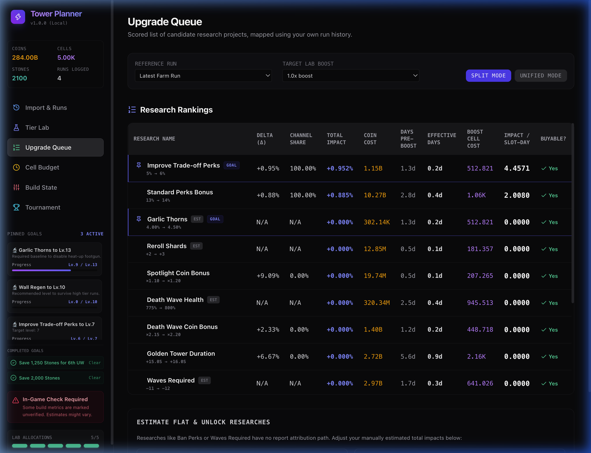
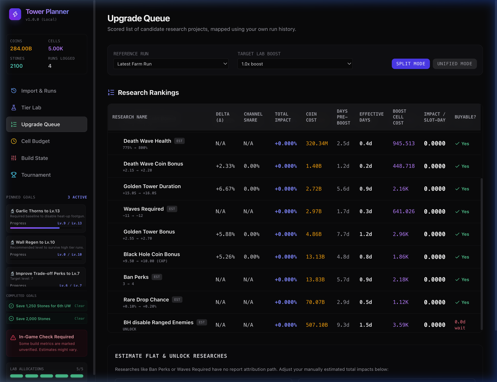
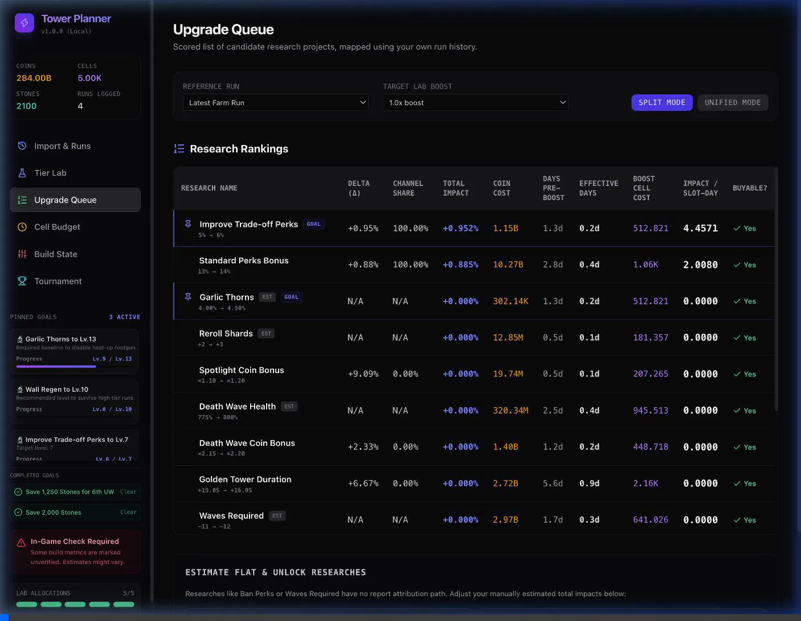

# Walkthrough — Scrollable Upgrade Queue Layout

We have resolved the layout and scrollability issue in the Upgrade Queue. The entire layout now fits the screen viewport height properly on desktop, keeping the sidebar fixed, while the rankings table has its own scroll window with sticky column headers.

## Changes Made

### 1. Constrained Desktop Viewport Height
In [`Layout.tsx`](file:///Users/mbp-m1-pro/Developer/projects/tower-planner/src/components/Layout.tsx):
- Constrained the outer wrapper height on desktop using `md:h-screen md:overflow-hidden` so that the window body itself does not scroll and push the sidebar off the screen.
- Added `md:h-full md:overflow-y-auto` to the sidebar `<aside>` element to ensure it can scroll independently if the list of active/pinned goals grows.
- The main content area's native `overflow-y-auto` now behaves as intended, scrolling only the page content.

### 2. Made Research Rankings Table Scrollable Vertically
In [`UpgradeQueue.tsx`](file:///Users/mbp-m1-pro/Developer/projects/tower-planner/src/components/UpgradeQueue.tsx):
- Wrapped the Research Rankings table inside a scrollable container constrained to `max-h-[60vh]` with `overflow-auto`.
- Made the table column headers sticky (`sticky top-0 z-10`) with a solid, high-opacity background (`bg-zinc-900/95 backdrop-blur-sm`).
- Added `scrollbar-gutter-stable` to prevent horizontal layout shift when the vertical scrollbar appears.

---

## Visual Verification

### Before Scroll
The Upgrade Queue page is displayed, fitting cleanly within the viewport height. The sidebar shows all resources and options.

### After Scrolling Rankings Table
When scrolling inside the rankings table, the rows scroll smoothly under the sticky headers, keeping column labels constantly visible. The sidebar and filters remain fully static.

### Interaction Recording
Here is a recording showing the full viewport behavior, table scrolling, and independent sidebar scrolling:

