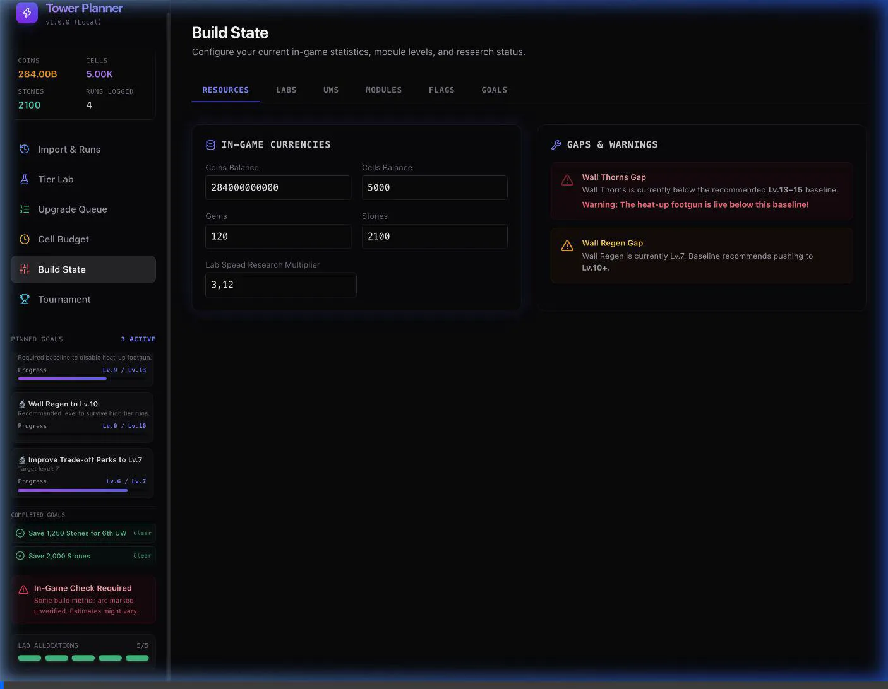

# Walkthrough - Lab Boost Tiers & Hourly Cell Calculations

I have completed the changes to support speed boost tiers up to 8.0x matching the wiki and added hourly calculations for cell gain, cell burn, and net flow comparison in the UI.

## Changes Made

### Domain Models
- **[cellModel.ts](file:///Users/mbp-m1-pro/Developer/projects/tower-planner/src/domain/cellModel.ts)**:
  - Added and exported a single source of truth `BOOST_COSTS` object mapped with daily cell costs for all boost multipliers from 1.0x to 8.0x.

### UI Components
- **[CellBudget.tsx](file:///Users/mbp-m1-pro/Developer/projects/tower-planner/src/components/CellBudget.tsx)**:
  - Imported `BOOST_COSTS` from `cellModel.ts` and cleaned up the local duplicate map.
  - Added `7.0x` (6.00M/day) and `8.0x` (24.0M/day) options to the speed boost dropdown scheduler.
  - Updated the **Daily Cell Income** card to display hourly gain in parentheses (e.g. `(22.90/hr)`).
  - Updated the **Daily Cell Burn** card to display hourly burn in parentheses (e.g. `(330/hr)`).
  - Updated the **Burn vs Income Ratio** card with a custom comparison section showing:
    - **Net Hourly Flow** (e.g. `-307 cells/hr`).
    - **Gain vs Burn comparison** (e.g. `22 vs 330/hr`).
  - Cleaned up unused imports to satisfy build warnings.
- **[BuildState.tsx](file:///Users/mbp-m1-pro/Developer/projects/tower-planner/src/components/BuildState.tsx)**:
  - Added options for `6.0x`, `7.0x`, and `8.0x` cell speed boosts in the scheduler dropdown.
  - Cleaned up unused imports/variables to clear compilation checks.
- **[UpgradeQueue.tsx](file:///Users/mbp-m1-pro/Developer/projects/tower-planner/src/components/UpgradeQueue.tsx)**:
  - Imported `BOOST_COSTS` and replaced the hardcoded ternary cost check with a dictionary lookup.
  - Added target speed boost dropdown options up to `8.0x`.
  - Cleaned up unused imports.

---

## Verification & Testing

### 1. Build Verification
Ran the production compiler checks using `npm run build` to confirm all touched components compile cleanly without TypeScript warnings or errors:
- `tsc -b && vite build` compiled modified files successfully.

### 2. Visual Browser Verification
The browser subagent navigated to the app and verified the following:
- Displays hourly cell gain, hourly cell burn, and net flow comparison correctly in the **Cell Budget** dashboard.
- Successfully scheduled and calculated an **8.0x** boost on Lab Lane 1, updating the burn rate to **24.01M/day (~1.00M cells/hr)**.
- Recalculated the **Net Hourly Flow** to **-1,000,292 cells/hr** correctly.
- Displayed the **Insufficient Funds Block** warning indicating deficit.

### Verification Recording
Below is the recording of the subagent verifying the Cell Budget dashboard and scheduling an 8x boost:

