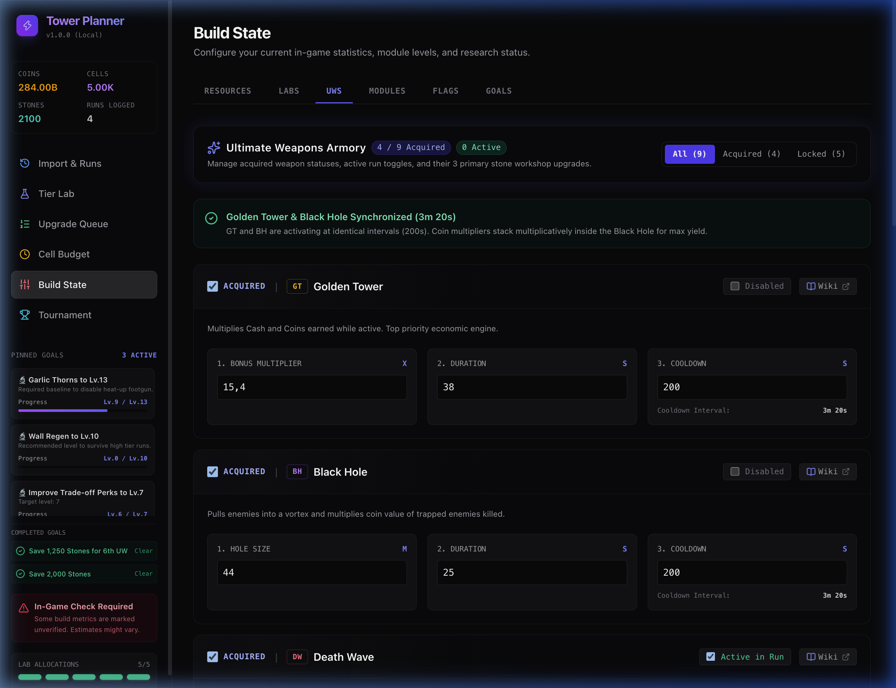
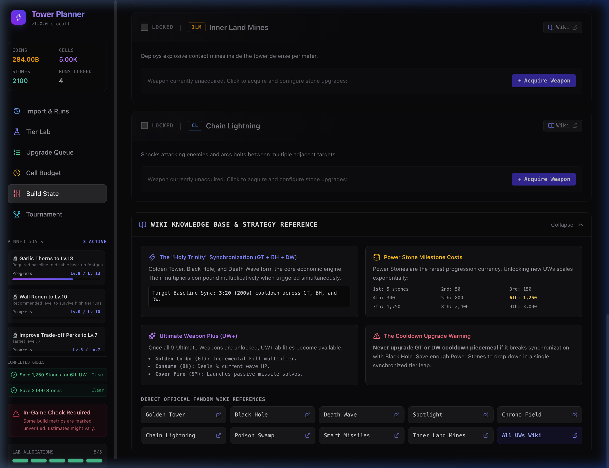

# Ultimate Weapons (UWs) List, Status Checks, 3 Upgrades & Wiki Section

## Summary of Changes

We have restructured the **Ultimate Weapons (UWs)** section in **Build State** to meet all requirements:

1. **List Layout**: Transformed the compact pill grid into a vertical list view for all 9 Ultimate Weapons with glowing accents and responsive cards.
2. **Acquired & Active Checks**:
   - **Acquired Checkbox**: Clearly indicates if the weapon is owned or locked. Unlocking dynamically reveals its 3 stone upgrades and activates the weapon.
   - **Active in Runs Toggle**: Dedicated checkbox to enable/disable the weapon during runs.
3. **3 Main Upgrades Per UW (Wiki Referenced)**:
   - Each weapon features its 3 official stone workshop upgrades with labels, step-tunable numeric inputs, and units.
   - For cooldowns (in seconds), human-readable interval helpers (e.g., `200s → 3m 20s`) are displayed automatically.
4. **Golden Tower & Black Hole Synchronization Banner**:
   - Real-time monitor checking if GT and BH cooldowns match (e.g., `200s (3m 20s)`), providing immediate synergy feedback.
5. **In-App Wiki Reference Section**:
   - Collapsible knowledge base containing:
     - **Holy Trinity Sync Guide** (GT + BH + DW).
     - **Power Stone Milestone Costs** (1st to 9th UW unlock curve).
     - **Ultimate Weapon Plus (UW+)** abilities overview.
     - **Cooldown Golden Rule** warning.
     - **Direct Wiki Navigation** buttons linking to all 9 individual Fandom wiki weapon guides and the main wiki page.

---

## 9 Ultimate Weapons & Their 3 Upgrades Reference

| Weapon | Upgrade 1 | Upgrade 2 | Upgrade 3 | Cooldown Helper | Wiki Page |
|---|---|---|---|---|---|
| **Golden Tower (GT)** | Bonus Multiplier (`x`) | Duration (`s`) | Cooldown (`s`) | `200s (3m 20s)` | [GT Wiki](https://the-tower-idle-tower-defense.fandom.com/wiki/Golden_Tower) |
| **Black Hole (BH)** | Hole Size (`m`) | Duration (`s`) | Cooldown (`s`) | `200s (3m 20s)` | [BH Wiki](https://the-tower-idle-tower-defense.fandom.com/wiki/Black_Hole) |
| **Death Wave (DW)** | Wave Damage (`%`) | Wave Quantity (`waves`) | Cooldown (`s`) | `200s (3m 20s)` | [DW Wiki](https://the-tower-idle-tower-defense.fandom.com/wiki/Death_Wave) |
| **Spotlight (SL)** | Bonus Damage (`x`) | Beam Angle (`°`) | Beam Quantity (`beams`) | Continuous | [SL Wiki](https://the-tower-idle-tower-defense.fandom.com/wiki/Spotlight) |
| **Chrono Field (CF)** | Duration (`s`) | Speed Reduction (`%`) | Cooldown (`s`) | `60s (1m)` | [CF Wiki](https://the-tower-idle-tower-defense.fandom.com/wiki/Chrono_Field) |
| **Chain Lightning (CL)** | Shock Damage (`%`) | Bolt Quantity (`bolts`) | Proc Chance (`%`) | Proc Based | [CL Wiki](https://the-tower-idle-tower-defense.fandom.com/wiki/Chain_Lightning) |
| **Poison Swamp (PS)** | Swamp Damage (`%`) | Swamp Duration (`s`) | Spawn Chance (`%`) | On Death | [PS Wiki](https://the-tower-idle-tower-defense.fandom.com/wiki/Poison_Swamp) |
| **Smart Missiles (SM)** | Missile Damage (`x`) | Missile Quantity (`missiles`) | Cooldown (`s`) | `150s (2m 30s)` | [SM Wiki](https://the-tower-idle-tower-defense.fandom.com/wiki/Smart_Missiles) |
| **Inner Land Mines (ILM)** | Mine Damage (`%`) | Mine Quantity (`mines`) | Cooldown (`s`) | `120s (2m)` | [ILM Wiki](https://the-tower-idle-tower-defense.fandom.com/wiki/Inner_Land_Mines) |

---

## Visual Verification

---

## Tests & Quality Checklist
- `npx tsc --noEmit` passed with 0 errors.
- `npx vitest run` passed (6/6 tests passing).
- State updates persist in browser `localStorage` under `tower-planner-store`.
