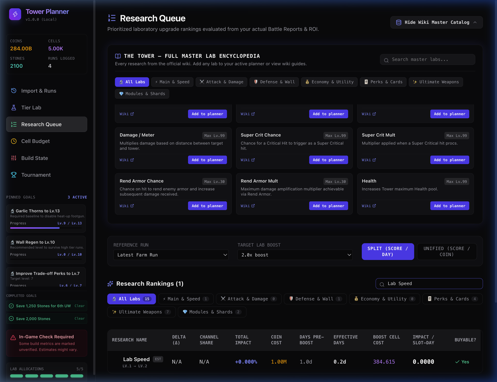

# Walkthrough: Add to Planner Button Cleanup & Functionality Fix

Cleaned up the button text to **"Add to planner"** and fixed the catalog insertion/removal functionality in [ResearchQueue.tsx](file:///Users/mbp-m1-pro/Developer/projects/tower-planner/src/components/ResearchQueue.tsx) and [store.ts](file:///Users/mbp-m1-pro/Developer/projects/tower-planner/src/domain/store.ts).

## Changes Completed

### 1. Button Label Cleanup
- Removed the duplicate `(+) +` icons/symbols.
- Button now reads cleanly: **`Add to planner`**.

### 2. Store & Button Functionality Fix
- Updated `updateResearchCatalog` in [store.ts](file:///Users/mbp-m1-pro/Developer/projects/tower-planner/src/domain/store.ts) to support upsert behavior when adding previously untracked labs.
- Added dedicated `addResearchCatalogItem` and `removeResearchCatalogItem` actions to store state.
- In [ResearchQueue.tsx](file:///Users/mbp-m1-pro/Developer/projects/tower-planner/src/components/ResearchQueue.tsx):
  - Clicking **`Add to planner`** immediately adds the lab into your active `researchCatalog`, updates the research rankings table in real-time, and flips the card button to **`In Planner`**.
  - Added a **`Remove`** button to allow removing labs back to the master list if desired.

## Verification Screenshot

## Verification Results
- **TypeScript & Vite Build**: Passed with 0 errors.
- **OxLint**: Passed with 0 errors.
- **Browser Automation Verification**:
  - Verified button displays `Add to planner`.
  - Clicked `Add to planner` on *Lab Speed*.
  - Verified card button updated to `In Planner` + `Remove`.
  - Confirmed *Lab Speed* immediately populated into the Research Rankings table with full ROI calculations.
