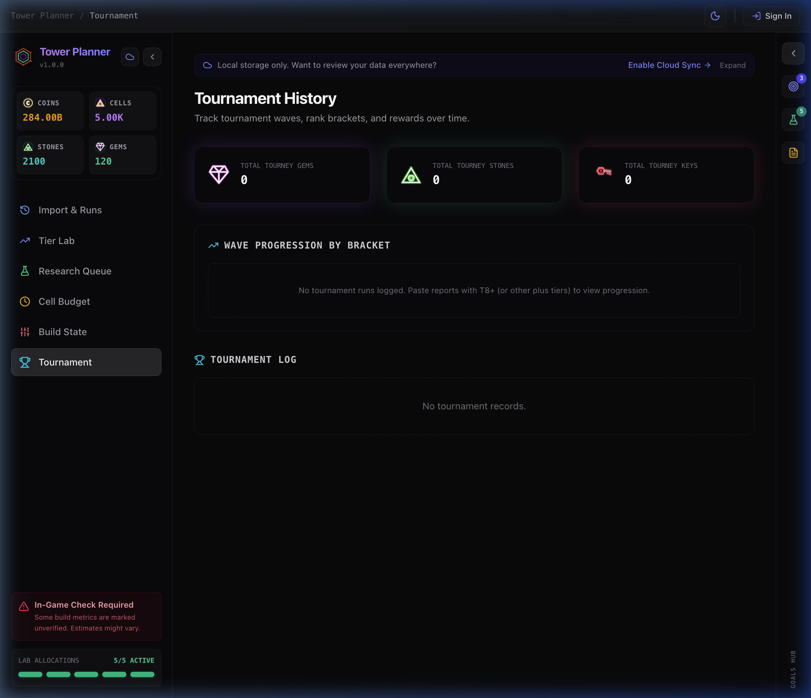
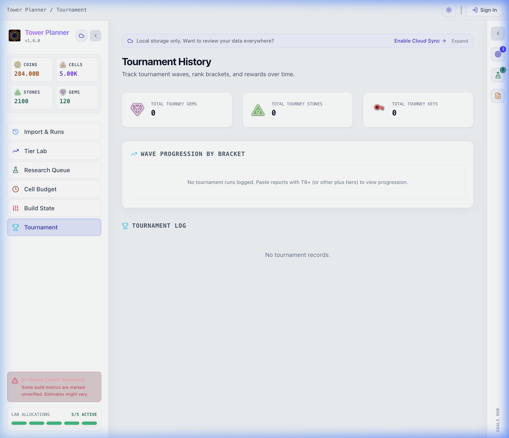
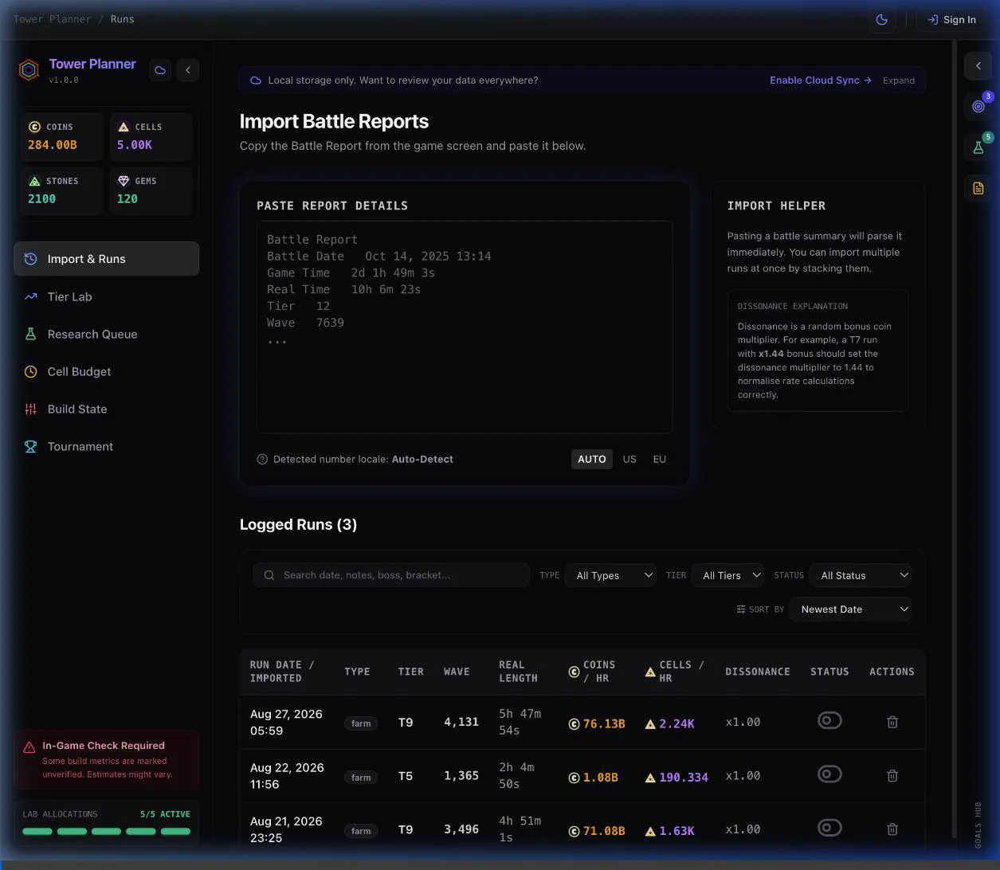

# Walkthrough: Tournament Cards Shadow Glows & Red Sci-Fi Key Icon

We have updated the Tournament overview cards, glowing shadows, and currency icons according to the game's authentic visual style:

---

## 1. Summary of Changes

### Tournament Overview Cards & Shadows ([`TournamentHistory.tsx`](file:///Users/mbp-m1-pro/Developer/projects/tower-planner/src/components/TournamentHistory.tsx) & [`index.css`](file:///Users/mbp-m1-pro/Developer/projects/tower-planner/src/index.css))
- **Total Tourney Gems Card**:
  - Shadow: **Purple glow** (`glow-purple` with `box-shadow: 0 0 25px rgba(168, 85, 247, 0.20)`).
  - Icon: Purple gem diamond icon (`CurrencyIcon currency="gems"`).
- **Total Tourney Stones Card**:
  - Shadow: **Green glow** (`glow-emerald` with `box-shadow: 0 0 25px rgba(16, 185, 129, 0.20)`). Fixed the missing shadow by defining all color glows (`.glow-green`, `.glow-teal`, `.glow-emerald`) in CSS.
  - Icon: Green Power Stone triangle icon (`CurrencyIcon currency="stones"`).
- **Total Tourney Keys Card**:
  - Shadow: **Red glow** (`glow-rose` / `glow-red` with `box-shadow: 0 0 25px rgba(244, 63, 94, 0.20)`).
  - Icon: **Modern Red Sci-Fi Key** (`public/assets/currencies/keys.svg`), replacing the old skeleton key icon to accurately match *The Tower* game's aesthetic.

### Currency System Updates ([`CurrencyIcon.tsx`](file:///Users/mbp-m1-pro/Developer/projects/tower-planner/src/components/CurrencyIcon.tsx))
- Added `keys` to `CurrencyType` with `'Tourney Keys'`, red text color (`text-rose-400`), red background/border, and vector SVG asset.
- Updated `gems` configuration to purple (`text-purple-400`, `border-purple-500/30`).
- Updated `stones` configuration to emerald/green (`text-emerald-400`, `border-emerald-500/30`).
- Updated the Tournament Log table headers and row items with fitting icons and colored text.

---

## 2. Visual Verification

### Verification Summary
- **Total Tourney Gems**: Verified purple gem icon with matching purple neon glow.
- **Total Tourney Stones**: Verified green Power Stone icon with matching green neon glow.
- **Total Tourney Keys**: Verified red sci-fi tournament key icon with matching red neon glow.
- **Light & Dark Themes**: Verified contrast and clean shadows across both themes.

### Screenshots & Recording

